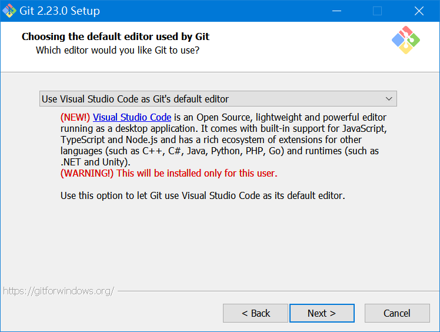
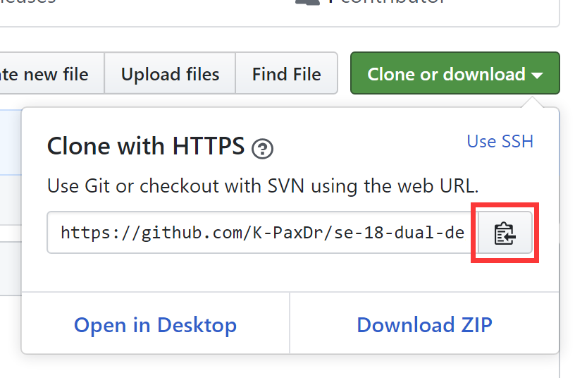
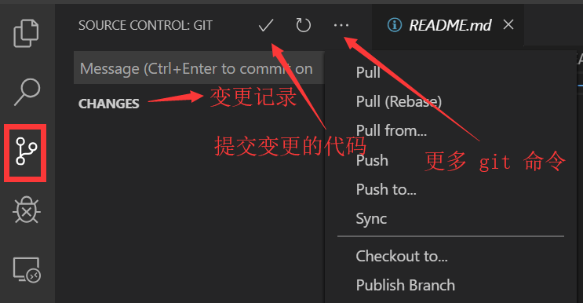

# VSCode git 使用指南

## 环境配置

下载 vscode，安装之。

下载 git 。

https://npm.taobao.org/mirrors/git-for-windows

选择合适的版本，在安装过程中，使用 vscode 作为默认编辑器。



打开 github.com 网站，注册用户。

注册完成之后，在右上角的头像上点击，选择 settings，将 public profile 中的 Name 改写为：学号+真实姓名。

打开文件管理器，新建你的项目文件夹 xxx。

打开 vscode，将 xxx 文件夹拖入 vscode，ctrl+shift+~ 打开终端，敲入如下命令进行 git 配置：

```shell
git config --global user.name "你注册 github 使用的用户名" 
git config --global user.email "你注册 github 使用的邮件地址"
```

如果每次打开 github 网站麻烦，你可以使用官方推出的桌面版：

https://desktop.github.com/

## 术语

- repositories

  仓库。可建多个。分为本地仓库 local 和远程仓库 remote，本地就是在你自己电脑上的那个文件夹，远程就是在 github 上的。

- projects

  项目。一个仓库下面可以多个项目。

- terminal

  终端。特指命令提示符窗口，分为 command/powershell 两种。
  
- branch

  分支。一个仓库有一个默认的分支 master，也可以建立不同的分支。

- HEAD

  文件的当前版本叫做 HEAD。

  HEAD^ 上一个版本，HEAD^^ 上上一个版本，HEAD~100 上一百个版本。

- stage

  暂存区，也叫做 index，相对应的持久区就是 branch，关系如下：

  

## git 命令

命令这一块并不是特别重要了，不管是 github 还是 vscode 等工具，都已经将命令进行菜单化了，但学习命令的目的主要是为了搞清楚各个术语的含义，不了解这个 github 用不好。

- clone 仓库地址

  克隆仓库，将 github 已经建设好的仓库克隆到本地。

- add 文件

  添加文件到仓库。

- rm 文件

  删除文件。

- commit -m '提交消息'

  提交变更。

## 开始工作

### 作为拥有者

克隆在 github 上建立好的仓库。

打开 github，转到你的仓库，复制仓库地址：



在刚才的 vscode 终端窗口中，输入：

```shell
git clone https://github.com/K-PaxDr/se-18-dual-degree.git
```

点击左侧的 Source Control 图标，即可打开源码控制（采用 GIT）器。



一般情况下，任何变更点击 "√" 就可以了。

### 作为参与者

打开 https://github.com/K-PaxDr/se-18-dual-degree，点击 Fork，搞定后，点击 Clone or download，拷贝 git 地址。

打开文件管理器，新建一个目录 xxx，打开 vscode，将 xxx 拖入进来，打开终端（ctrl+shift+~）执行：

```shell
git init
git config user.name "你注册 github 使用的用户名" 
git config user.email "你注册 github 使用的邮件地址"
git clone https://github.com/K-PaxDr/se-18-dual-degree.git
```

然后就可以在 vscode 中做各种编辑了，然后在终端中执行：`git push`，将你的更改 push 到你自己的 fork 后远程仓库。

所有操作都要注意是否完成（向上的箭头表示上传）：


在没有完成之前，你在 github 各种刷新都看不到最新结果。

然后转到 github 网站，打开你 fork 的参考，点击 New pull request，创建一个新的推送请求，如果显示 There isn’t anything to compare，表示你前面并没有做任何文件更新或没有 push，或者 base fork 搞反了，前面的 base-fork 选择自己的仓库，点击 switching the base 切换。

填好后，点击 Create pull request / Merge pull request，之后就等待老师的批准。

## 其他

### 私有库

github 还支持一种私有库（private），可以通过 Settings/Collaborators 来添加协作者。


